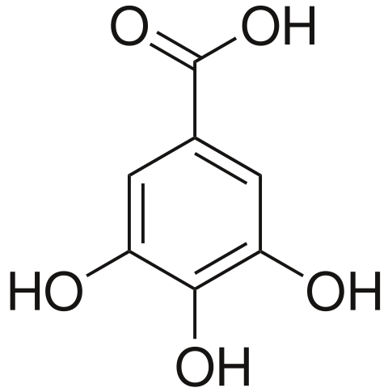

## Ciprés [ *Cupressus sempervirens* ]

El ciprés es un árbol de entre 25-30 m de altura, de hoja perenne, que puede llegar a vivir más de 1000 años. Es original de regiones del este del Mediterráneo. No se sabe por qué es un árbol cultivado históricamente en los cementerios. Tal vez los antiguos pensaban que al ser un árbol que siempre está verde y apuntando al cielo ayudaba a las almas de los muertos a elevarse en esa dirección.

Tiene alto contenido en taninos. Los taninos son metabolitos secundarios de las plantas, fenólicos, no nitrogenados, solubles en agua. Abundan en las cortezas de algunos árboles y en las hojas de muchas plantas. La astringencia de los taninos es lo que causa la sensación de sequedad y ligero amargor al consumir frutos que todavía no están maduros, vino o té.

Los taninos son compuestos producidos por las plantas como defensa natural. Hay estudios que sugieren que los taninos modulan la composición y la función microbiana del intestino en los animales, inhibiendo selectivamente los patógenos y promoviendo el crecimiento de bacterias beneficiosas. Además, los taninos se consideran compuestos bioactivos por su capacidad de modular los procesos metabólicos y promover la salud actuando como antitumorales, antibacterianos y antimicóticos. Sin embargo, estos efectos beneficiosos no están científicamente demostrados y algunos estudios incluso sugieren efectos negativos de los taninos en dosis altas sobre nuestra salud. Más investigación es necesaria para conocer los efectos de los taninos sobre la salud humana y animal. Un ejemplo de tanino es el [ácido gálico](https://es.wikipedia.org/wiki/%C3%81cido_g%C3%A1lico).

### Pregunta: ¿de dónde procede la palabra tanino?

 [ ] De la primera planta de la que se aisló: la taniquera.

 [x] De su uso para convertir las pieles crudas de animales en cuero, proceso conocido en inglés como tanning ("curtido", en español)

 [ ] De la palabra turca “tanik”, que significa rojo.

**Explicación**: Los taninos se utilizan en el curtido porque reaccionan con las proteínas de colágeno presentes en las pieles de los animales, uniéndolas entre sí; de esta forma, aumenta la resistencia de la piel al calor, a la putrefacción por agua y al ataque por microbios.

[[inicio]](https://eead-csic-compbio.github.io/plantoquimica)
