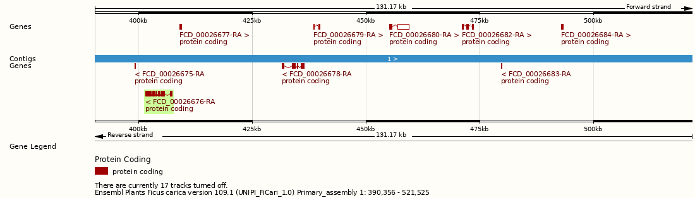

## Higuera [ *Ficus carica* ]

La [higuera](https://www.arbolapp.es/especies/ficha/ficus-carica) es un arbusto o árbol pequeño de la familia de las Moráceas que no suele sujperar los 6m. Su tronco es gris ceniza y liso y a menudo tortuoso. Las hojas son caducas, ásperas al tacto y palmeadas con 3-5 lóbulos. Además tienen látex, que se observa muy bien al tronchar el rabillo de la hoja. La infrutescencia se llama higo o breva y su color va del verde al morado, con pulpa carnosa y dulce. Las higueras pueden crecer en suelos marginales y pobres. Debido a su extensión como cultivo desde antiguo, no se conoce su origen exacto. Actualmente se distribuye por el sur de Europa, norte de África y el occidente asiático, con numerosas variedades cultivadas.

La floración y fructificación se produce en el verano. Es un proceso 
[complejo](https://es.wikipedia.org/wiki/Ficus_carica), 
ya que hay árboles monoicos, variedades con flores masculinas o femeninas no funcionales, 
así como plantas que producen higos sin polinización, de forma asexual. 
La polinización la llevan a cabo diferentes especies de avispas.

Recientemente se ha secuenciado el genoma completo del cultivar femenino
[Dottato](https://onlinelibrary.wiley.com/doi/10.1111/tpj.14635), 
obteniendo una secuencia de ADN de 333 Mbp. 
El mapa del genoma ha permitido localizar en el cromosoma 1 el gen
[RAN1](https://plants.ensembl.org/Ficus_carica/Location/View?db=core;g=FCD_00026676;r=1:390356-521525;t=FCD_00026676-RA),
también llamado FCD_00026676,  
y la region de 100Kbp aguas arriba, que determinan el 
[sexo de las higueras](https://www.ncbi.nlm.nih.gov/pmc/articles/PMC5264649):

### Pregunta: ¿Qué uso se le daba antiguamente al látex o leche de higo?

 [ ] No caerá esa breva.

 [ ] Para hacer guantes.

 [ ] Para cuajar la leche.

[solución](./Ficus_carica_solucion.md)

[[inicio]](https://eead-csic-compbio.github.io/plantoquimica)

