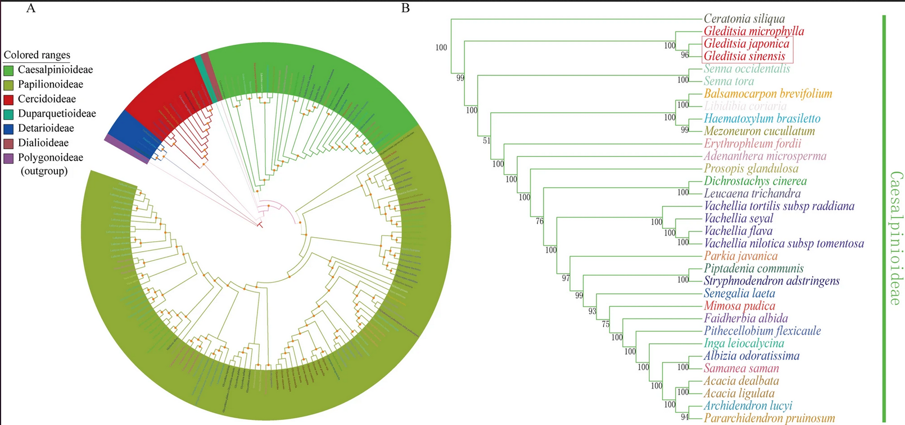

## Acacia de tres espinas [ *Gleditsia triacanthos* ]

La [acacia de tres espinas](https://www.arbolapp.es/especies/ficha/gleditsia-triacanthos)
es una leguminosa natural de NortaAmérica, pero se ha adaptado muy bien en nuestras ciudades
tras ser introducida. Crece rápido, soporta bien la sequía, la contaminación y las podas severas.

Es un árbol grande y corpulento que puede alcanzar los 40 m, de corteza gris lisa y agrietada.
Tiene espinas en grupos de tres, con una central gruesa y dos laterales algo más finas, 
y hojas caducas compuestas por 8-20 hojuelas. El fruto es una legumbre muy vistosa y grande 
que con frecuencia permanece en el árbol después de haberse caído las hojas. 
Se parece al fruto del árbol autóctono del 
[algarrobo](https://www.arbolapp.es/especies/ficha/ceratonia-siliqua) 
(*Seratonia siliqua*), pero es una vaina más grande y estrecha, de color café.

El genoma de los cloroplastos, los orgánulos donde ocurre la fotosíntesis,
se utiliza a menudo para desentrañar la historia evolutiva de las plantas.
En comparación con el genoma nuclear de la planta, el cloroplástico es mucho más
pequeño y fácil de estudiar. En un trabajo de [2020](https://www.nature.com/articles/s41598-020-73392-7/figures/5) 
se compararon los de 155 especies y se encontró que efectivamente las gleditsias y los 
algarrobos son especies muy cercanas:

### Pregunta: ¿Qué país es el mayor productor de algarrobas?

 [ ] Italia

 [ ] Líbano

 [x] España

