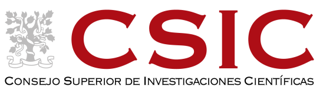

## Bioquímica en la ciudad: Plantoquímica

Textos preparados originalmente por Bruno Contreras Moreira y Manuel Matamoros Galindo 
([Estación Experimental de Aula Dei](https://www.eead.csic.es)-[CSIC](https://www.csic.es/es)) para la 
[actividad satélite](https://congresos.sebbm.es/zaragoza2023/bioquimica-en-la-ciudad-plantoquimica)
del 45 Congreso de la Sociedad Española de Bioquímica y Biología Molecular en Zaragoza (5-8 de septiembre de 2023).
Vanesa Martínez imprimió las etiquetas con los códigos QR para escanear.

