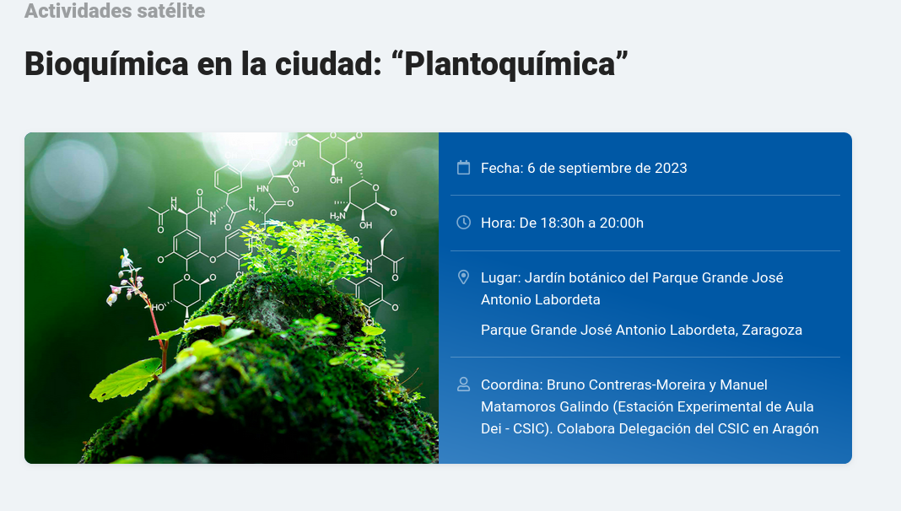

## Bioquímica en la ciudad: Plantoquímica

Esta página contiene historias y preguntas para entretener durante un paseo bioquímico y genómico 
por el [jardín botánico del Parque Grande de Zaragoza](https://www.zaragoza.es/sede/servicio/equipamiento/541).

Puedes encontrarlas mientras caminas por el jardín, 
en forma de códigos QR en las placas de árboles seleccionados que deberás escanear con el móvil,
o haciendo click en la siguiente lista:

* [*Corylus avellana*](./Corylus_avellana.md)
* [*Cupressus sempervirens*](./Cupressus_sempervirens.md)
* [*Ficus carica*](./Ficus_carica.md)
* [*Fraxinus angustifolia*](./Fraxinus_angustifolia.md)
* [*Gleditsia triacanthos*](./Gleditsia_triacanthos.md)
* [*Ilex pernyi*](./Ilex_pernyi.md)
* [*Juniperus phoenicea*](./Juniperus_phoenicea.md)
* [*Myrtus communis*](./Myrtus_communis.md)
* [*Olea europaea*](./Olea_europaea.md)
* [*Opuntia ficus-indica*](./Opuntia_ficus-indica.md)

[[Mapa de alta resolución]](./pics/jardin-botanico-145.jpg)

### URL

https://eead-csic-compbio.github.io/plantoquimica

### Ejemplo de QR 

### Créditos
 
Textos preparados originalmente por Bruno Contreras Moreira y Manuel Matamoros Galindo 
([Estación Experimental de Aula Dei](https://www.eead.csic.es)-[CSIC](https://www.csic.es/es)) para la 
[actividad satélite](https://congresos.sebbm.es/zaragoza2023/bioquimica-en-la-ciudad-plantoquimica)
del 45 Congreso de la 
[Sociedad Española de Bioquímica y Biología Molecular](https://sebbm.es) 
en Zaragoza (5-8 de septiembre de 2023).
Vanesa Martínez colaboró en la preparación de los códigos QR.

<!---->

